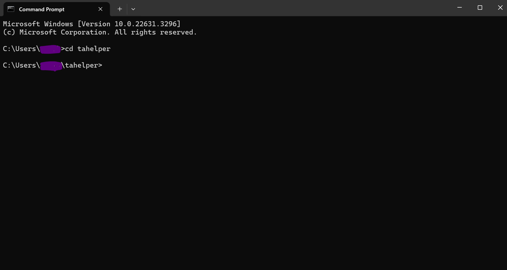
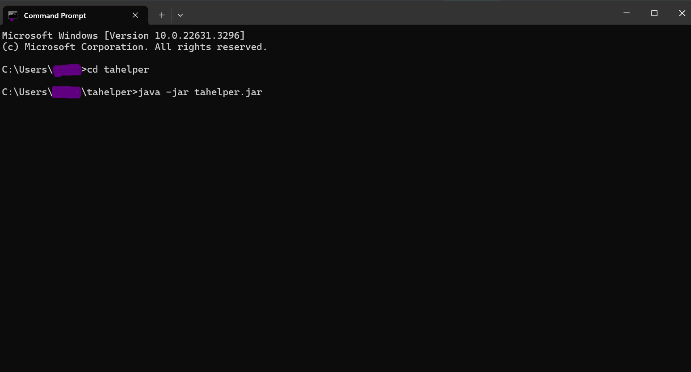
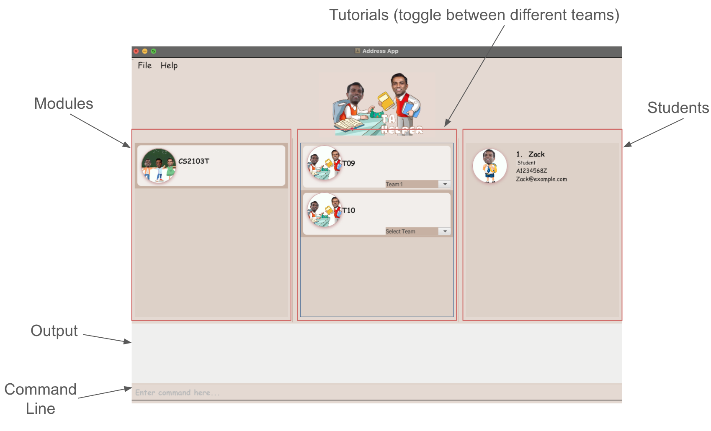

# TAHelper User Guide

TAHelper is a **desktop app for managing contacts, optimized for use via a Line Interface** (CLI) while still having the benefits of a Graphical User Interface (GUI). If you can type fast, TAHelper can get your students' contact management tasks done faster than traditional GUI apps.

- For some uncommon or unfamiliar terms used in this User Guide, [click here](#glossary) for the definition and explanation of some.

## Why choose TAHelper?

## Table of contents
- [TAHelper User Guide](#tahelper-user-guide)
- [Why choose TAHelper](#why-choose-tahelper)
- [Target Audience](#target-audience)
- [Purpose of User Guide](#purpose-of-user-guide)
- [Navigating the User Guide](#navigating-the-user-guide)
- [Quick Start](#quick-start)
- [Navigating the GUI](#navigating-the-gui)
- [Features](#features)
  - [Command Format](#command-format)
  - [Adding new students](#adding-new-students--addstudent)
  - [Deleting students](#deleting-students--deletestudent)
  - [Searching for students](#searching-for-students--searchstudent)
  - [Edit student contacts](#edit-student-contact--editstudent)
  - [Listing all students](#listing-all-students--liststudents)
  - [Sort all students](#sort-all-students--sortstudents)
  - [Adding new tutorial class](#adding-new-tutorial-class--addclass)
  - [Deleting tutorial class](#deleting-tutorial-class--deleteclass)
  - [Deleting modules](#deleting-modules--deletemodule)
  - [Listing all tutorial classes](#listing-all-tutorial-classes--listclasses)
  - [Adding student to tutorial class](#adding-student-to-tutorial-class--addstudenttoclass)
  - [Deleting students from tutorial class](#deleting-students-from-tutorial-class--deletestudentfromclass)
  - [Adding new tutorial team](#adding-new-tutorial-team--addteam)
  - [Allocating students to tutorial teams](#allocating-students-to-tutorial-teams--allocateteam)
  - [Listing all students of a tutorial class](#listing-all-students-of-a-tutorial-class--classliststudents)
  - [View a team in tutorial class](#view-a-team-in-a-tutorial-class--viewteams)
  - [Randomly allocate into teams all students in a tutorial class](#randomly-allocate-into-teams-all-students-in-a-tutorial-class--randomteams)
  - [Deleting students from team](#deleting-students-from-team--deletestudentfromteam)
- [FAQ](#faq)
- [Known issues](#known-issues)
- [Glossary](#glossary)
- [Command summary](#command-summary)

---

## Target Audience

- TAHelper is specifically designed to assist and help Teaching Assistants (TA) of NUS Computer Science Modules,
which caters to their need to store information in a way that is easy to track and visualise, as well as keep student's
details in a centralised storage. This makes it easy for TAs to disseminate information and reference contact information of their students easily.
Our target audience is specifically only TAs of NUS Computer Science Modules.

[Back to table of contents](#table-of-contents)

### Assumptions about our Target Audience
1. Firstly, being TAs of a Computer Science (CS) module in NUS, we can safely assume that they have a decent grasp of basic of CLI and
basic software that they have learnt from many of the introductory CS modules they have taken in NUS.
2. Secondly, being well-versed with many technical terms and absorbing large amounts of information through all the modules and studying they have been through,
we can safely assume that most, if not all of our users will be able to comprehend and familiarise themselves with not only the User Guide but also our TAHelper system.
This essentially allows them to seamlessly integrate themselves with TAHelper and make it user-friendly for them.
3. Thirdly, another assumption made is that each module and tutorial class has its own Excel sheet for student management purposes. This cause information to be sparse and make it slightly more difficult to access.
We can expect that highly utility for TAs who teach more than 1 tutorial class as it provides more convenience for communications between students, and handling of administrative task.

[Back to table of contents](#table-of-contents)

## Purpose of User Guide
- The purpose of the User Guide (UG) for TAHelper is to provide our target users, TAs of NUS Computer Science modules, with a comprehensive resource that
helps user effectively use and understand our application. In the User Guide, we display clear instructions, a quick start guide, and explanations to help users use TAHelper seamlessly
and effectively. This help users learn the new system in an extremely short timeframe, while allowing them to understand this application deeply, optimise their workflows and improve their
student contact management in the classes they teach.

[Back to table of contents](#table-of-contents)

## Navigating the User Guide
Welcome to the TAHelper User Guide! Our goal is to assist and provide you the luxury of information, knowledge and utmost
confidence to make full use of TAHelper's features.

- Effortless Navigation: [Refer here](#table-of-contents) for the table of contents to aid your navigation.
- Quick start guide for New Users: If you're a new user, visit our [Quick Start](#quick-start) section to set up and launch the application!
- Features: Want to leverage the capabilities of TAHelper? Visit our [Features](#features) section to fully utilise the features we offer!

[Back to table of contents](#table-of-contents)

## Quick start

1. Ensuring the correct version of Java installed:
    - Ensure you have Java `11` or above installed in your Computer.

2. Download TAHelper from [here](https://github.com/AY2324S2-CS2103T-T09-4/tp/releases)
    - Download the latest `tahelper.jar`.

3. Set up your application environment
    - Copy the file `tahelper.jar` to the folder you want to use as the _home folder_ for your TAHelper.
    - Tip: name that folder `TAHelper` to facilitate organisation and easy access.

4. Using the Terminal to run the application
    - Windows OS:
      - Press the windows button and type `cmd` into the search bar.
      - Then `cd` into the folder you put the jar file in.
      - It should look something like this:
      

    - Mac OS:
      - Search for Terminal in "Utilities" under "Applications".
      - It should look something like this:

5. Launching TAHelper
    - Type `java -jar tahelper.jar` command and hit Enter to run TAHelper. 
    - It should look something like this (in this case my jar file is in a folder called `tahelper`):
    
    - A GUI similar to the below should appear in a few seconds. 
    .

6. Here are some commands to try out to get a feel of a TAHelper! type them in the Command box
    - `/add_student name/Dohn Joe email/johndoe@gmail.com id/A0123456A`: Adds a new student contact with the name, email and ID specified.
      - A new student entry should appear on the UI with the details reflected clearly.

    - `/delete_student id/A0123456A or /delete_student email/johndoe@gmail.com`: Deletes the student that you have add with the previous command.
      - The student entry with the ID `A0123456A` or email `johndoe@gmail.com` will be deleted.
      - This deletion will be reflected on User Interface of TAHelper as well.

    - For more Commands that will improve your experience, [click here](#command-summary)

[Back to table of contents](#table-of-contents)

## Navigating the GUI

- Users can enter their command in the `Command Line`. The output of their commands will be shown in the `Output` box
- All modules are listed under the `Modules` column
- All tutorial classes belonging to the selected module are listed under the `Tutorials` column
- Within each tutorial class, the team can be selected from the dropdown menu.
- Depending on the user interaction, the list of students in the module, tutorial or team will be shown under the `Students` column. For example, clicking on a module card will display all students in that module. Similarly, clicking on a tutorial class and selecting a team from the dropdown will display all students in that team.
- For extra help, users can click on the `Help` button at the top left hand corner of the GUI, which will navigate to the user guide.

[Back to table of contents](#table-of-contents)

Commands on students:

   - `/add_student name/Dohn Joe email/johndoe@gmail.com id/A0123456A`: Adds a new student contact with all the details.

   - `/delete_student id/A0259209B or /delete_student email/johndoe@gmail.com` : Deletes a student contact with email `johndoe@gmail.com` or id `A0259209B`.

   - `/search_student id/A0123456A or /search_student email/johndoe@gmail.com` : Searches for a student with id `A0123456A` or email `johndoe@gmail.com`.

   - `/edit_student index/1 name/John` : Edits the first student's name to `John`

   - `/list_students` : View the list of all students available.

   - `/sort_students by/id or by/name` : Sorts the list of students in lexicographical order by id or name.

   - `/allocate_team id/A1234567Z module/CS2101 tutorial/T01 team/team1` : Allocate a student to the specified team `team1` in the tutorial class `T01` of module `CS2101`.

   - `/add_student_to_class id/A1234567Z module/CS2101 tutorial/T01` : Add the student with the student id `A1234567Z` to the tutorial class `T01` of module `CS2101`.

   - `/delete_student_from_class id/A1234567Z module/CS2101 tutorial/T01` : Deletes the student with the student id `A1234567Z` from the tutorial class `T01` of module `CS2101`.

   - `/delete_student_from_team id/A1234567Z module/CS2101 tutorial/T01 team/Team 1` : Deletes the student with the student id `A1234567Z` from the team `Team 1` in tutorial class `T01` of module `CS2101`.

Commands on modules:

   - `/add_class module/CS2103T tutorial/T09` : Adds a new tutorial class `T09` under the module `CS2103T`.

   - `/delete_class module/CS2103T tutorial/T09` : Deletes the tutorial class `T09` under the module `CS2103T`.

   - `/delete_module module/CS2103T` : Deletes the module `CS2103T` from the system.

   - `/list_classes` : List of all tutorial classes available.

   - `/class_list_students module/CS2103T tutorial/T09` : List all the students in the tutorial class `T09` under the module `CS2103T`.

   - `/add_team module/CS2103T tutorial/T09 team/Team 1` : Adds a new team with team name `Team 1` to tutorial class `T09` under the module `CS2103T`.

   - `/delete_team module/CS2103T tutorial/T09 team/Team 1` : Removes the team with team name `Team 1` from tutorial class `T09` under the module `CS2103T`.

   - `/random_teams module/CS2103T tutorial/T09 teams/4` : Randomly allocates all students in the tutorial class `T09` under the module `CS2103T` into different teams in the tutorial class.
   
   - `/view_teams name/Team 1 module/CS2103T tutorial/T09` or `/view_teams index/1 module/CS2103T tutorial/T09` : View the information of the team with team name `Team 1` or index `1` in tutorial class `T09` under module `CS2103T`

1. Refer to the [Features](#features) below for details of each command.

[Back to table of contents](#table-of-contents)

---
## Features

<box type="info" seamless/>

**Notes about the command format:** 
### Command Format
Here are the main components of the commands:

| Component    | Example                | Description                                                                                                                                       |
|--------------|:-----------------------|---------------------------------------------------------------------------------------------------------------------------------------------------|
| Command Word | /add, /search, /delete | The type of command to be executed by the system.                                                                                                 |
| Prefix       | name/, email/, id/     | The attributes of the quantity observed.                                                                                                          |
| Parameters   | NAME, EMAIL, STUDENT_ID | The value of the attribute that the user have to provide after the prefix.                                                                        |
| Index        | 1, 3                   | The position of the student in the list it is referencing. Eg. Index 1 of tutorial class `T01` refers to the 1st student in the `T01` class list. |

Here are symbols used in the commands:

| Symbol | Example         | Description                                                                          |
|--------|:----------------|--------------------------------------------------------------------------------------|
| `[ ]`  | `[email/EMAIL]` | The parameter `email` is optional and specifying it may not yield additional results |
| NONE   | `id/STUDENTID`  | The parameter `id` needs to be specified. It is compulsory.                          |

Parameters:

| Field       | Prefix       | Description/Constraints                                                                                                                                                                                                                                                                                                                                                                                                                                               |
|-------------|:-------------|-----------------------------------------------------------------------------------------------------------------------------------------------------------------------------------------------------------------------------------------------------------------------------------------------------------------------------------------------------------------------------------------------------------------------------------------------------------------------|
| NAME        | name/        | Alphanumeric characters                                                                                                                                                                                                                                                                                                                                                                                                                                               |
| EMAIL       | email/       | need to follow the format `example@mail.com`                                                                                                                                                                                                                                                                                                                                                                                                                          |
| STUDENT_ID   | id/          | Follows the format of NUS Student ID that starts with A. Format must be `A`, followed 7 numeric digits, and end off with a alphabetical letter.                                                                                                                                                                                                                                                                                                                       |
| MODULE      | module/      | Follows the format of NUS CS modules, which starts with either 2 or 3 alphabetical letters, followed by 4 numeric integer between 0-9, and an optional alphabetical letters.  Note: Module codes are case sensitive (must be in all capitals), so `CS2103T` is valid but `cs2103t` is not                                                                                                                                                                         |
| TUTORIAL    | tutorial/    | Follows the format of most NUS tutorial class naming, which starts with 1 alphabetical letter and 2 numeric integers from 0-9.   Note: Tutorial class names are case sensitive (must be a capital letter), so `T09` is valid but `t09` is not.  As of now, tutorial class names with other formats are not accepted. (such as `TO43`)                                                                                                                         |
| TEAM_NAME    | team/        | Alphanumeric characters.  As of now, the team related error messages may sometimes add `Team` before the team name, which might lead to confusion.   To clarify this, for all purposes, the team name is stored as the exact name you give, and the word `Team` is not appended to it. (e.g. `team/1` is stored as team name `1` and not team name `Team 1`).   The actual name of the team is shown in the UI within the tutorial class it was added under. |
| TAG         | tag/         | Tag associated with the student.  Alphanumeric characters                                                                                                                                                                                                                                                                                                                                                                                                             |
| SIZE        | size/        | The size of the team or class. A numeric integer value that is more than 0.                                                                                                                                                                                                                                                                                                                                                                                    |
| DESCRIPTION | description/ | The description of the module.                                                                                                                                                                                                                                                                                                                                                                                                                                        |
| BY          | by/          | The parameter you want to search by. Alphanumeric characters                                                                                                                                                                                                                                                                                                                                                                                                          |
| INDEX       | index/       | The index of the associated student. A numeric integer value that is more than 0.                                                                                                                                                                                                                                                                                                                                                                                                                          |

Here are symbols used in the commands:

- Words in `UPPER_CASE` are the parameters to be supplied by the user.
  e.g. in `add name/NAME`, `NAME` is a parameter which can be used as `add name/John Doe`.  

- Items in square brackets are optional.
  e.g `/add_class module/MODULE tutorial/TUTORIAL [description/DESC] [size/SIZE]` can be used as `/add_class module/CS2103T tutorial/T09`.  

- Parameters must follow the order specified in the user guide.
  e.g. if the command specifies `name/NAME id/ID', it has to be in this format.  

- Extraneous parameters for commands that do not take in parameters (such as `list_student`) will be ignored.
  e.g. if the command specifies `list_student 123`, it will be interpreted as `list_student`.   

- If you are using a PDF version of this document, be careful when copying and pasting commands that span multiple lines as space characters surrounding line-breaks may be omitted when copied over to the application.
  </box>

[Back to table of contents](#table-of-contents)

---
### Adding new students : `add_student`

Adds a new student contact with all the details that have been specified by the user.

Format: `/add_student name/NAME email/EMAIL id/STUDENT_ID [tag/TAG]` 

- The following parameters to add a student contact are supported:

  1. Name
  2. Email
  3. Student ID

- All fields must be specified
- Leading/trailing spaces are removed
- The parameter is case-insensitive
- If none of the parameters or an invalid parameter is specified, the command will return an error message indicating that a valid parameter must be provided.

Expected output:
Upon a successful add, the command will return a confirmation messaging stating that the specified student contact has been added.

Example:

- `/add_student name/Dohn Joe email/johndoe@gmail.com id/A0123456A`

Explanation: This adds a student with name `Dohn Joe`, email `johndoe@gmail.com` and ID `A0123456A` into the TAHelper system.

[Back to table of contents](#table-of-contents)

---
### Deleting students : `delete_student`

Delete a student contact based on the parameter specified by the user.

Format: `/delete_student [id/STUDENT_ID] [email/EMAIL] [index/INDEX]`

- At least one of the optional parameters (id/email/index) must be provided.
- Leading/trailing spaces are removed.
- A complete match must be provided in order for successful operation.
- If the specified student belongs to any tutorial class/teams, the student will be deleted from that particular class/team as well.
- If the specified student is not found, it returns an error.
- If no parameters are specified, it returns an error.

Expected output:
Upon successful deletion, the command will return a confirmation messaging stating that the specified student contact has been removed.

Examples:

- Delete by student ID: `/delete_student id/A01234567X`
- Delete by email: `/delete_student email/e0123456@u.nus.edu`
- Delete by index: `/delete_student index/1`

[Back to table of contents](#table-of-contents)

---
### Searching for students : `search_student`

Search for a student's contact based on specified query.

Format: `/search_student [id/STUDENT_ID] [email/EMAIL] [name/NAME]`

- At least one of the optional attributes must be provided.
- The search query is case-insensitive. e.g. `ian` will match `Ian`
- The search query will match information corresponding to the optional attribute. e.g. `id/` will only search for IDs
- Partial matches will also be displayed e.g. `@gmail` will return **ALL** emails containing `@gmail`

Expected output:
The command will display the list of all students that match the corresponding prefix.  If there are no existing students, the command will return a message indicating that there are no students listed.

Examples:
- `/search_student id/A012345A` Returns student with corresponding id
- `/search_student email/@GMAIL` Returns all students who have `@gmail` in their email

[Back to table of contents](#table-of-contents)

---
### Edit student contact: `edit_student`

Edit a student contact by index number in the displayed student list.

Format: `/edit_student index/INDEX [id/STUDENT_ID] [email/EMAIL] [name/NAME]`

- Index has to be a positive integer.
- At least one of the optional parameters must be provided.
- Multiple parameters can be provided (not duplicates). Command will edit all parameters specified.
- If the edited student id or email already exists in the list, the command will return an error message.

Expected output:
Upon successful editing, the command will return a confirmation message stating that the student contact has been edited along with the edited student contact.

Examples:
- `/edit_student index/1 name/Aaron` will edit the student's name at index 1
- `/edit_student index/5 id/A1234567B email/new_email@gmail.com` will edit the student's id and email at index 5

[Back to table of contents](#table-of-contents)

---
### Listing all students : `list_students`

View the list of all students available

Format: `/list_students`

Expected output:
The command will display the list of all students along with their student information. If there are no matching students, a message will display indicating no students listed.

[Back to table of contents](#table-of-contents)

---
### Sort all students: `sort_students`

Sorts the list of students by specified parameter

Format: `/sort_students by/BY`

- Available parameters include: `name`, `id`, `email`
- Only one parameter can be used per command call
- Students' contacts are sorted in lexicographical order.

Expected output:
The command will display the list of all students, sorted by the specified parameter, in lexicographical order.

Examples:
- `/sort_students by/name`
- `/sort_students by/email`

[Back to table of contents](#table-of-contents)

---
### Adding new tutorial class : `add_class`

Adds a tutorial class with the specified module code and name.

Format: `/add_class module/MODULE tutorial/TUTORIAL [description/DESC] [size/SIZE]`

Note:
- An optional class size can be specified to apply a size restriction on the class.   If no class size is specified, it will create an unbounded class (i.e. infinite max size)
- Class size must be a positive integer. Any invalid inputs (non-numeric, negative integers) returns an error.
- If none of the parameters is specified, or if only one is specified, returns an error.
- If the module already exists in the system, the system will add the tutorial class specified to the existing module.
  Else, the system will create a new module with module code `MODULE_CODE` and add the specified tutorial class under it. 
  As such, there is no `add_module` command, as this command doubles up to do that too.

Examples:
- `/add_class module/CS2103T tutorial/T10`  
Explanation: If module `CS2103T` already exists in the system, adds a tutorial class `T10` to the existing module.
Else, creates a new module `CS2103T` with 1 tutorial class under it: `T10`
- `/add_class module/CS2109S tutorial/T01 description/Introduction to AI size/10`  
Explanation: If module `CS2109S` already exists in the system, adds a tutorial class `T01` to the existing module.
  Else, creates a new module `CS2109S` with 1 tutorial class with description `Introduction to AI` and class size of `10` under it: `T01`

[Back to table of contents](#table-of-contents)

---
### Deleting tutorial class : `delete_class`

Deletes a specified tutorial class from the list of classes.

Format: `/delete_class module/MODULE tutorial/TUTORIAL`

Note:
- If the module code does not exist, it returns an error.
- If the tutorial class within that module code does not exist, it returns an error and the list of tutorial classes in that module code.
- If no parameters are specified, returns an error
- The module itself will not be deleted upon deletion of all of its tutorial classes. To delete the module itself, see `delete_module`

Examples:

- `/delete_class module/CS2103T tutorial/T10`
Explanation: Deletes tutorial class `T10` from the module `CS2103T`
- `/delete_class module/CS2109S tutorial/T01`
Explanation: Deletes tutorial class `T01` from the module `CS2109S`

[Back to table of contents](#table-of-contents)

---
### Deleting modules : `delete_module`

Deletes a specified module from the system.

Format: `/delete_module module/MODULE`

- If the module code does not exist, it returns an error.
- If no parameters are specified, returns an error

Examples:

- `/delete_module module/CS2103T`  
Explanation: Deletes module `CS2103T` from the system
- `/delete_module module/CS2109S`  
Explanation: Deletes module `CS2109S` from the system

[Back to table of contents](#table-of-contents)

---
### Listing all tutorial classes: `list_classes`

Shows a list of all tutorial classes in the address book.

Format: `list_classes`

Expected output: The command will display the list of all tutorial classes. If there are no existing classes, the command will return a message indicating that there are no classes currently.

[Back to table of contents](#table-of-contents)

---
### Adding student to tutorial class : `add_student_to_class`

Adds a specified student based on the provided parameter to a specified tutorial class.

Format: `/add_student_to_class [id/STUDENTID] [index/INDEX] [email/EMAIL] module/MODULE tutorial/TUTORIAL`

- At least one of the optional parameters (id/email/index) must be provided.
- If the module code does not exist, it returns an error.
- If the tutorial class within that module code does not exist, it returns an error.
- If the student does not exist, it returns an error.
- If no parameters are specified, it returns an error.

Expected output:
Upon successful allocation of student to the tutorial class, the command will return a confirmation messaging stating that the specified student has been added to the class.

Examples:

- Add student by Student ID:`/add_student_to_class id/A01234567X module/CS2103T tutorial/T10`
- Add student by email: `/add_student_to_class email/test@gmail.com module/CS2103T tutorial/T10`
- Add student by index: `/add_student_to_class index/1 module/CS2103T tutorial/T10`

[Back to table of contents](#table-of-contents)

---
### Deleting students from tutorial class: `delete_student_from_class`

Deletes the specified student from a specified team.

Format: 
1. By ID: `/delete_student_from_class id/STUDENT_ID module/MODULE tutorial/TUTORIAL`
2. By email: `/delete_student_from_class email/EMAIL module/MODULE tutorial/TUTORIAL`
3. By index: `/delete_student_from_class index/INDEX module/MODULE tutorial/TUTORIAL`

- The student detail can be specified with either student id, email or the index of the student within the tutorial class.

Important Note:
- The tutorial class needs to be associated with the module specified.
- The student must be in the team before command execution.

Expected output: `Deleted STUDENT_NAME from MODULE TUTORIAL!`

Example: `/delete_student_from_class id/A0123456A module/CS2103T tutorial/T09`

Explanation: This deletes the student with student id `A0123456A` from tutorial class `T09` of module `CS2103T`

[Back to table of contents](#table-of-contents)

---
### Adding new tutorial team : `add_team`

Adds a new team with the specified team name to the specified tutorial class.

Format: `/add_team module/MODULE tutorial/TUTORIAL team/TEAM_NAME [size/TEAM_SIZE]`

- An optional team size can be specified to apply a size restriction on the team.
- Team size must be a positive integer. Any invalid inputs (non-numeric, negative integers) returns an error.
- Two teams are equal if they have the same name and belong to the same tutorial (i.e no tutorial should have more than 1 team with the same name), irregardless of size.
- If the module code does not exist, it returns an error.
- If the tutorial class within that module code does not exist, it returns an error.
- If the team already exists in that tutorial class, it returns an error.
- If no parameters are specified, it returns an error.

Expected output:
Upon successful addition, the command will return a confirmation messaging stating that the new team has been created and allocated to the specified tutorial class.

Examples:

- Without team size:`/add_team module/CS2103T tutorial/T10 team/Team 1`
- With team size: `/add_team module/CS2103T tutorial/T10 team/Team 1 size/3`

[Back to table of contents](#table-of-contents)

---
### Deleting team : `delete_team`

Deletes a specified team from the specified module and tutorial.

Format: `/delete_team module/MODULE tutorial/TUTORIAL team/TEAM_NAME`

- If the module code does not exist, it returns an error message.
- If the tutorial class within that module code does not exist, it returns an error.
- If the team within that tutorial class does not exist, it returns an error. 

Examples:

- `/delete_team module/CS2103T tutorial/T09 team/Team 1`  
Explanation: Deletes team `Team 1` from the module `CS2103T` and tutorial `T09`

[Back to table of contents](#table-of-contents)

---
### Allocating students to tutorial teams : `allocate_team`

Allocates a student to an existing tutorial team within a tutorial class.

List of acceptable formats: 
    1. By ID: `/allocate_team id/ID module/MODULE tutorial/TUTORIAL team/TEAM_NAME`
    2. By email: `/allocate_team email/EMAIL module/MODULE tutorial/TUTORIAL team/TEAM_NAME`
    3. By index: `/allocate_team index/INDEX module/MODULE tutorial/TUTORIAL team/TEAM_NAME`

- All fields from any acceptable formats have to be specified.
- Leading/trailing spaces are removed.
- A student cannot be added to the same tutorial team, under the same module and tutorial class, more than once.
- The index specified is with respect to the index of the student in the tutorial class.

Pre-conditions:
1. The student you want to add has to already exist in the TAHelper system.
2. The tutorial class has to be associated and exist in the module specified.
3. The student you want to add has to already exist in the tutorial class specified.
4. The team you want to allocate the student into has to already exist within the specified tutorial class.

Important note:
- Specifying more than one way to allocate student such as `/allocate_team id/ID email/EMAIL module/MODULE tutorial/TUTORIAL team/TEAM_NAME` is not advised. 
This is because TAHelper will prioritise looking for the student that matches the ID specified rather than the email specified. This prioritisation is a feature of the system.

Expected output:
Upon a successful allocation, the command will return a confirmation message stating that the specified student contact has been allocated to the tutorial team.

Examples:
1. `/allocate_team id/A1234567Z module/CS2101 tutorial/T01 team/team1` 

Explanation: This allocates a student with ID matching `A1234567Z` in the tutorial class `T01` to a tutorial team `team1` of the tutorial class `T01` under the module `CS2101`.

2. `/allocate_team email/johndoe@gmail.com module/CS2101 tutorial/T01 team/team2` 

Explanation: This allocates a student with email matching `johndoe@gmail.com` in the tutorial class `T01` to a tutorial team `team1` of the tutorial class `T01` under the module `CS2101`.

3. `/allocate_team index/1 module/CS2101 tutorial/T01 team/team1` 

Explanation: This allocates a student with index position `1` in the tutorial class `T01` to a tutorial team `team1` of the tutorial class `T01` under the module `CS2101`.

[Back to table of contents](#table-of-contents)

---
### Listing all students of a tutorial class : `class_list_students`

View the list of all students available

Format: `/class_list_students module/MODULE tutorial/TUTORIAL`

- If the module code does not exist, it returns an error.
- If the tutorial class within that module code does not exist, it returns an error.

Expected output:
The command will display the list of all students along with their student information. If there are no existing students, the command will return a message indicating that there are no students in that tutorial class.

Example:

- `/class_list_students module/CS2103T tutorial/T09`
- `/class_list_students module/CS2101 tutorial/T01`

[Back to table of contents](#table-of-contents)

---
### View a team in a tutorial class : `view_teams`

View the information about a team in a tutorial class.

Format: 
1. By team name: `/view_teams name/TEAM_NAME module/MODULE tutorial/TUTORIAL`
2. By index: `/view_teams index/INDEX module/MODULE tutorial/TUTORIAL`

- If the module code does not exist, it returns an error message.
- If the tutorial class within that module code does not exist, it returns an error message.
- If no parameters specified, it returns an error.
- If the team within that tutorial class does not exist, it returns an error.

Expected output:
The command will display the team with its information. If there is no such existing team, the command will return a error.

Example:

- View team by team name: `/view_teams name/Team 1 module/CS2103T tutorial/T09`
- View team by index: `/view_teams index/1 module/CS2103T tutorial/T09`

[Back to table of contents](#table-of-contents)

---
### Randomly allocate into teams all students in a tutorial class : `random_teams`

Randomly allocates all students in a tutorial class into different teams in the tutorial class.

Format: `/random_teams module/MODULE tutorial/TUTORIAL teams/NUMBER_OF_TEAMS`

- All fields from any acceptable formats have to be specified.
- Leading/trailing spaces are removed.

Important Note:
- The number of teams cannot be more than the number of students in the tutorial class.
- The tutorial class have to be associated with the module specified.
- The number of teams must be a non-negative integer value.

Expected output:
Upon a successful randomisation, the command will return a confirmation message stating that the students in the specified tutorial class has been randomly distributed into different teams in the tutorial class.

Example:
- `/random_teams module/CS2101 tutorial/T01 teams/2`

Explanation: This randomly allocates all the students in the tutorial class `T01` of module `CS2101` into 2 teams.

[Back to table of contents](#table-of-contents)

---
### Deleting students from team: `delete_student_from_team`

Deletes the specified student from a specified team.

Format:
1. By ID: `/delete_student_from_team id/STUDENT_ID module/MODULE tutorial/TUTORIAL team/TEAM_NAME`
2. By email: `/delete_student_from_team email/EMAIL module/MODULE tutorial/TUTORIAL team/TEAM_NAME`
3. By index: `/delete_student_from_team index/INDEX module/MODULE tutorial/TUTORIAL team/TEAM_NAME`

- The student detail can be specified with either student id, email or the index of the student within the tutorial team.

Important Note:
- The team needs to be associated with the tutorial class specified.
- The tutorial class needs to be associated with the module specified.
- As of now, the team related error messages may sometimes add `Team` before the team name, which might lead to confusion. To clarify this, for all purposes, the team name is stored as the exact name you give, and the word `Team` is not appended to it. As such, if you created the team with team name `1`, you need to use `delete_student_from_team` with team name `1` and not `Team 1`.

Expected output: `Deleted STUDENT_NAME from MODULE TUTORIAL, Team TEAM_NAME`

Example: `/delete_student_from_team id/A0123456A module/CS2103T tutorial/T09 team/4`
must be in the team before command execution.
 Explanation: This deletes the student with student id `A0123456A` from team `4` of tutorial class `T09` of module `CS2103T`

[Back to table of contents](#table-of-contents)

---
## FAQ

**Q**: How can I check the Java version on my computer? 
**A**: Open your command terminal (refer to [quick start point 4](#quick-start)) if you forgot, and type the following command: 
`java -version`

**Q**: How do I transfer my data to another Computer? 
**A**: Install the app in the other computer and overwrite the empty data file it creates with the file that contains the data of your previous TAHelper home folder. This file will be found in the data folder which you store the `tahelper.jar` at.

**Q**: Will my data be saved when using your app? 
**A**: Your data will always be saved in the data folder where you store the `tahelper.jar`. However, be sure to only make changes to the data through `tahelper` itself and do not directly alter the data from the data file.

[Back to table of contents](#table-of-contents)

---
## Known issues

1. **When using multiple screens**, if you move the application to a secondary screen, and later switch to using only the primary screen, the GUI will open off-screen. The remedy is to delete the `preferences.json` file created by the application before running the application again.

[Back to table of contents](#table-of-contents)

---
## Glossary

| Term                               | Definition and/or Explanation                                                                                                                                                                                  |
|------------------------------------|----------------------------------------------------------------------------------------------------------------------------------------------------------------------------------------------------------------|
| **OS**                             | Refers to Operating System. Modern Operating System include Windows, Macs and Linux.                                                                                                                           |
| **TA (Teaching Assistant)**        | An individual who is responsible for teaching a tutorial class of University students.                                                                                                                         |
| **TAHelper**                       | A contact management application to help TAs keep track of students in classes they teach.                                                                                                                     |
| **Graphical User Interface (GUI)** | is a type of interface that allows users to interact with electronic devices through graphical icons and visual indicators,  as opposed to text-based interfaces, typed command labels, or text navigation. |
| **Command Line Interface (CLI)**   | is a text-based user interface used to interact with software, through the use of key words command such as 'cd'.                                                                                              |
| **Lexicographical Order**          | is the ordering of strings based on the unicode value of each character in the string.                                                                                                                         |
| **CS**                             | Refers to Computer Science.                                                                                                                                                                                    |
| **NUS**                            | Refers to National University Of Singapore, which is located at Central Singapore.                                                                                                                             |
| **Command**                        | Refers to an action or input that the user types in `tahelper` to run a task for the user.                                                                                                                     |
| **Parameter**                      | Refers to a placeholder text that the user has to provide in order for `tahelper` to recognise the information they want when executing a command.                                                             |

[Back to table of contents](#table-of-contents)

---
## Command summary

| Action                                  | Format, Examples                                                                                                                                                                                                                                                                                                                                                                                         |
|-----------------------------------------|----------------------------------------------------------------------------------------------------------------------------------------------------------------------------------------------------------------------------------------------------------------------------------------------------------------------------------------------------------------------------------------------------------|
| **Add New Students**                    | `/add_student name/NAME email/EMAIL id/STUDENT_ID`    e.g: `/add_student name/Dohn Joe email/johndoe@gmail.com id/A0123456A`                                                                                                                                                                                                                                                                       |
| **Delete students**                     | By ID: `/delete_student id/STUDENT_ID` By email: `/delete_student email/EMAIL` By index: `/delete_student index/INDEX`   e.g: `/delete_student id/A0259209B`                                                                                                                                                                                                                                 |
| **Search for students**                 | By ID: `/search_student id/STUDENT_ID` By email: `/search_student email/EMAIL` By name: `/search_student name/NAME`   e.g:`/search_student id/A0123456A`                                                                                                                                                                                                                                     |
| **Edit student contact**                | `/edit_student index/INDEX [id/STUDENT_ID] [email/EMAIL] [name/NAME]`   e.g: `/edit_student index/1 name/John`                                                                                                                                                                                                                                                                                     |
| **Sort students**                       | `/sort_students by/BY` Supported parameters: id, name, email  e.g:`/sort_students by/id`                                                                                                                                                                                                                                                                                                           |
| **View all students**                   | `/list_students`                                                                                                                                                                                                                                                                                                                                                                                         |
| **Add new tutorial class**              | `/add_class module/MODULE tutorial/TUTORIAL [description/DESC] [size/SIZE]`    e.g: `/add_class module/CS2109S tutorial/T01 description/Introduction to AI size/10`                                                                                                                                                                                                                                |
| **Delete tutorial class**               | `/delete_class module/MODULE tutorial/TUTORIAL`    e.g: `/delete_class module/CS2103T tutorial/T09`                                                                                                                                                                                                                                                                                                |
| **View all classes**                    | `/list_classes`                                                                                                                                                                                                                                                                                                                                                                                          |
| **Add New Student to tutorial class**   | By ID: `/add_student_to_class id/STUDENT_ID module/MODULE tutorial/TUTORIAL` By Index: `/add_student_to_class index/INDEX module/MODULE tutorial/TUTORIAL` By email: `/add_student_to_class email/EMAIL module/MODULE tutorial/TUTORIAL`    e.g: `/add_student_to_class index/1 module/CS2103T tutorial/T09`                                                                                 |
| **Delete students from tutorial class** | By ID: `/delete_student_from_class id/STUDENT_ID module/MODULE tutorial/TUTORIAL` By index: `/delete_student_from_class index/INDEX module/MODULE tutorial/TUTORIAL` By email: `/delete_student_from_class email/EMAIL module/MODULE tutorial/TUTORIAL`   e.g: `/delete_student_from_class id/A1234561Z module/CS2103T tutorial/T09`                                                         |
| **List students of a tutorial class**   | `/class_list_students module/MODULE tutorial/TUTORIAL`    e.g: `/class_list_students module/CS2103T tutorial/T09`                                                                                                                                                                                                                                                                                  |
| **Delete module**                       | `/delete_module module/MODULE`    e.g: `/delete_module module/CS2103T`                                                                                                                                                                                                                                                                                                                             |
| **Add new team**                        | `/add_team module/MODULE tutorial/TUTORIAL team/TEAM_NAME [size/TEAM_SIZE]`    e.g: `/add_team module/CS2103T tutorial/T09 team/Team 1 size/5`                                                                                                                                                                                                                                                     |
| **Delete team**                         | `/delete_team module/MODULE tutorial/TUTORIAL team/TEAM_NAME`    e.g: `/delete_team module/CS2103 tutorial/T09 team/Team 4`                                                                                                                                                                                                                                                                        |
| **View team**                           | By name: `/view_teams name/TEAM_NAME module/MODULE tutorial/TUTORIAL`  By index: `/view_teams index/INDEX module/MODULE tutorial/TUTORIAL`   e.g: `/view_teams name/Team 1 module/CS2103T tutorial/T09`                                                                                                                                                                                         |
| **Randomly allocate team**              | `/random_teams module/MODULE tutorial/TUTORIAL teams/NUMBER_OF_TEAMS`    e.g: `/random_teams module/CS2103 tutorial/T09 teams/4`                                                                                                                                                                                                                                                                   |
| **Allocate students to team**           | `/allocate_team id/ID module/MODULE tutorial/TUTORIAL team/TEAM_NAME`    e.g: `/allocate_team id/A1234567K module/CS2103 tutorial/T09 team/Team 4`                                                                                                                                                                                                                                                 |
| **Delete students from team**           | By ID: `/delete_student_from_team id/STUDENT_ID module/MODULE tutorial/TUTORIAL team/TEAM_NAME`   By email: `/delete_student_from_team email/EMAIL module/MODULE tutorial/TUTORIAL team/TEAM_NAME`   By index: `/delete_student_from_team index/INDEX module/MODULE tutorial/TUTORIAL team/TEAM_NAME`    e.g:`/delete_student_from_team id/A1234567K module/CS2103 tutorial/T09 team/Team 4` |

[Back to table of contents](#table-of-contents)
